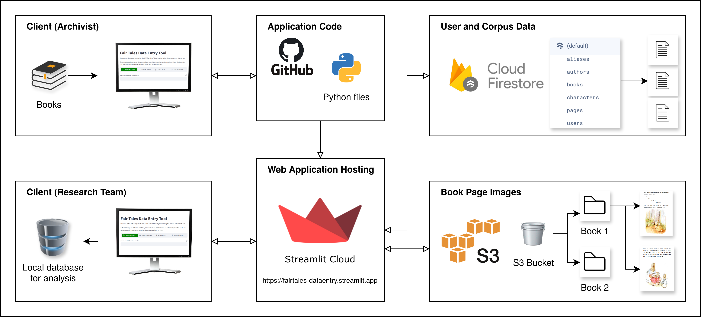

# Fair Tales Data Entry
Data entry tool for the Fair Tales project.

See the branch [mmr-chapter](https://github.com/Fair-Tales/FairTalesDataEntry/tree/mmr-chapter) or the corresponding [release](https://github.com/Fair-Tales/FairTalesDataEntry/releases/v-mmr-chapter) for the code version that relates to the chapter, published in the Edward Elgar handbook on mixed methods in education research, titled: `AI and cloud data collection as tools for mixed methods research: a case study on gender in young children’s story books`. 

The diagrams below illustrate the software architecture and the user flow during data entry. Readers wishing to adapt this tool for use in their own research are encouraged to explore the codebase and contact the lead authors with any questions. We are currently expanding our dataset by crowdsourcing of data collection and are inviting users to contribute by using this tool - please get in touch if you are interested!

The tool is hosted for public use on Streamlit Cloud here: [https://fairtales-dataentry.streamlit.app/](https://fairtales-dataentry.streamlit.app/)

The tool can be installed locally for testing and exploration of its functionality using the following steps:
* Clone this repository or download and extract a csv of the code
* Create a Python virtual enviroment and use pip to install the requirements.
* From the project root directory run: ```streamlit run Home.py```

### Software Architecture Diagram


### User-flow Diagram

